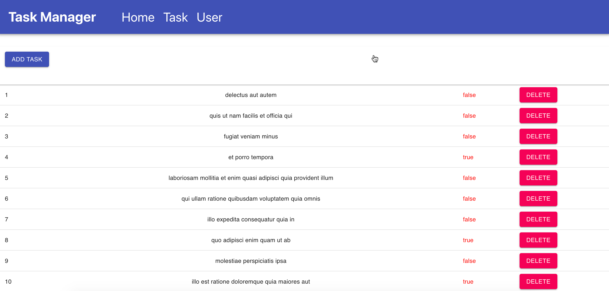

# Kredence Assignment Task Manager 

## Task Page

## User Page

## Home Page

# How to setup the Project on local System?
    1.First you need to download this repo.
    2.Then open in the editor.
    3.Install Node js in your system if not installed.
    4.run the command for installing the modules.
     >>npm install
    5.run the project by commmand
    >> npm start

